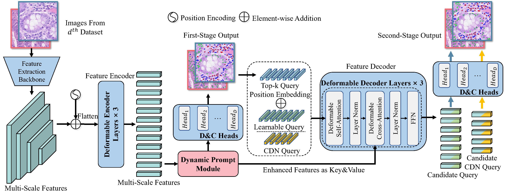

# UniCell
UniCell: Universal Cell Nucleus Classification via Prompt Learning, AAAI 2024

The recognition of multi-class cell nuclei can significantly facilitate the process of histopathological diagnosis. Numerous pathological datasets are currently available, but their annotations are inconsistent. Most existing methods require individual training on each dataset to deduce the relevant labels and lack the use of common knowledge across datasets, consequently restricting the quality of recognition. In this paper, we propose a universal cell nucleus classification framework (UniCell), which employs a novel prompt learning mechanism to uniformly predict the corresponding categories of pathological images from different dataset domains. In particular, our framework adopts an end-to-end architecture for nuclei detection and classification, and utilizes flexible prediction heads for adapting various datasets. Moreover, we develop a Dynamic Prompt Module (DPM) that exploits the properties of multiple datasets to enhance features. The DPM first integrates the embeddings of datasets and semantic categories, and then employs the integrated prompts to refine image representations, efficiently harvesting the shared knowledge among the related cell types and data sources. Experimental results demonstrate that the proposed method effectively achieves the state-of-the-art results on four nucleus detection and classification benchmarks.


## Overall Framework


## Requisities
-`python=3.8`
-`pytorch=1.12.0`
-`torchvision=0.13.0`

## Installation
**step 0.** Install mmcv and mmengine using mim
```
pip install -U openmim
mim install mmengine==0.7.2
mim install mmcv==2.0.0
pip install timm==0.6.13
pip install ftfy==6.1.1
pip install regex==2023.3.23
pip install einops==0.6.0
```
**step 1.** Git clone the repository
```
git clone https://github.com/lhaof/UniCell.git
```
**step 2.** Install UniCell
```
cd UniCell/mmdetection
python -m pip install -e .
```
**step 3.** Install SAHI
```
cd projects/UniCell/tools/sahi
python -m pip install -e .
```

## Dataset Preparation
**step 0.** Download the dataset from [google drive](https://drive.google.com/file/d/1VFQnAvVM918pS3co7J_hbGcGsOvJVuo1/view?usp=sharing) and unzip it to `UniCell/dataset/`.

**step 1.** Modify the `dataset_path` in `projects/UniCell/tools/prepare_fourdataset_4Dataset_CMOL.py` and run it to generate the dataset.
```
python prepare_fourdataset_4Dataset_CMOL.py
```

## Training
Modify the `dataset_path` in `projects/UniCell/configs/nuclei_det_multihead_cmol.py` and run the following command to train the model.
### Training on a single GPU
```shell
python ./tools/train.py tools/train.py projects/UniCell/configs/UniCell_CMOL.py\
	--work-dir=${SAVE_DIR}
```
### Training on multiple GPUs
```shell
bash ./tools/dist_train.sh projects/UniCell/configs/UniCell_CMOL.py\
    ${GPU_NUM} --work-dir=${SAVE_DIR}
```

## Testing
**step 0.** Download the universal model from [google drive](https://drive.google.com/file/d/1dLZj-R9cXhiRjvU2oKPsAM8qZN9079uZ/view?usp=sharing).

**step 1.** Modify the `path_to_dataset` and `checkpoint` path in `projects/UniCell/tools/inference_multihead.py` and run it to test the model.
```
python inference_multihead.py
```